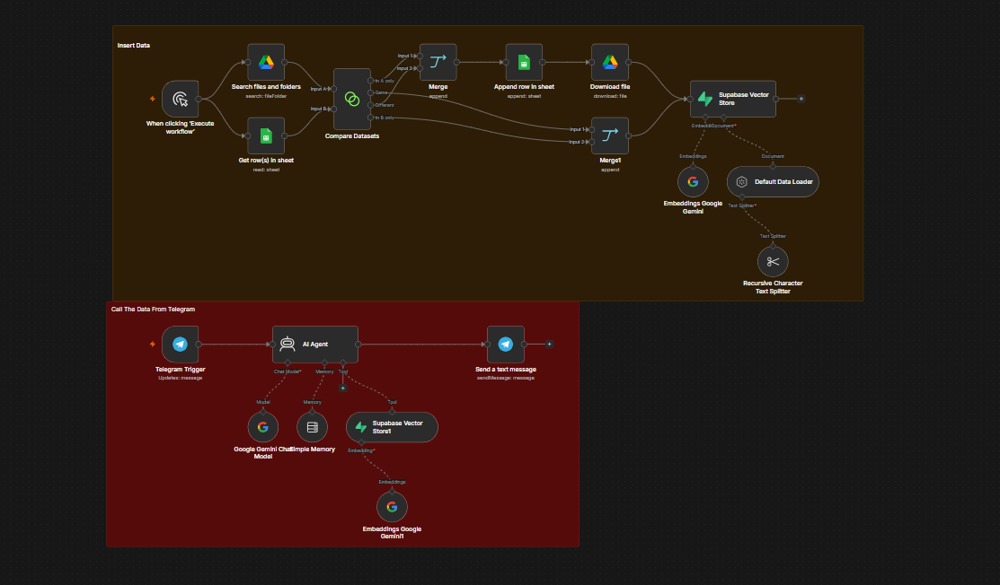

# 📚 AI School RAG System

An AI-powered Retrieval-Augmented Generation (RAG) system built with n8n that automatically indexes PDF documents from Google Drive into Supabase Vector Database and allows users to query them through Telegram using Google Gemini.

---

## 🚀 Features

- 📂 Automatically monitors Google Drive for PDF files
- 📄 Downloads new PDF documents
- 🔍 Detects duplicate files using Google Sheets
- 🧠 Splits documents into chunks
- ✨ Creates embeddings using Google Gemini
- 🗄️ Stores embeddings in Supabase Vector Store
- 🤖 Telegram AI Assistant
- 💬 Natural language question answering
- ⚡ Fully automated workflow with n8n

---

## 🏗️ Architecture



---

## ⚙️ Technologies

- n8n
- Google Drive API
- Google Sheets API
- Google Gemini
- Supabase
- PostgreSQL + pgvector
- Telegram Bot API

---

## 🔄 Workflow

### Document Pipeline

1. Search PDFs in Google Drive
2. Compare with indexed files
3. Skip duplicates
4. Download new PDFs
5. Split text into chunks
6. Generate embeddings
7. Save vectors to Supabase
8. Register file inside Google Sheets

---

### Chat Pipeline

1. User sends a message on Telegram
2. AI Agent searches the Vector Database
3. Relevant chunks are retrieved
4. Google Gemini generates the answer
5. Telegram returns the response

---

## 📷 Workflow Screenshot


---

## 📦 Installation

Clone the repository

```bash
git clone https://github.com/yourusername/AI-School-RAG-System.git
